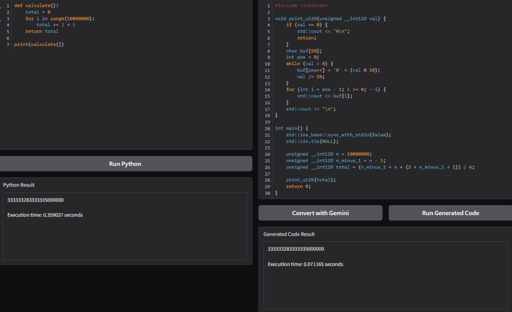

# AI Code Porting & Performance Tool

AI Code Porting & Performance Tool is a Python application that uses Google Gemini to convert Python code into optimized C++ or Rust and compare the behavior and performance of both versions.

The application allows users to test the original Python program, compile and run the generated code, compare outputs, and measure execution time through a Gradio web interface.

## Overview

The project provides a simple workflow for experimenting with code translation and performance comparison between interpreted and compiled languages.

The application can:

- Convert Python code to C++ or Rust
- Generate optimized code using Google Gemini
- Run the original Python code
- Compile and run generated C++ or Rust code
- Compare execution results
- Measure execution time
- Detect local system and compiler information
- Display the workflow through a Gradio interface

## Application Preview

The following example shows a Python program converted into optimized C++ code and executed through the Gradio interface.



In this example, both the original Python program and the generated C++ program return the same result:

```text
33333328333335000000
```

The measured execution times are:

```text
Python execution time: 0.359037 seconds
Generated C++ execution time: 0.071165 seconds
```

The generated C++ version runs significantly faster while preserving the same output.

## How It Works

1. The user enters Python code.
2. C++ or Rust is selected as the target language.
3. Gemini converts the Python program into optimized compiled code.
4. The original Python code is executed.
5. The generated code is compiled and executed.
6. The application compares the program output.
7. Execution times are measured and displayed for comparison.

```text
Python Code
    |
    v
  Gemini
    |
    v
C++ or Rust
    |
    v
Compile & Run
    |
    +----------------+
    |                |
    v                v
Python Result    Compiled Result
    |                |
    +--------+-------+
             |
             v
   Output & Performance
        Comparison
```

## Tech Stack

- Python
- Google Gemini
- Gradio
- C++
- Rust
- g++
- rustc
- python-dotenv

## Project Structure

```text
ai-code-porting-tool/
│
├── main.py
├── system_info.py
├── styles.py
├── .env
├── .gitignore
├── requirements.txt
└── docs/
    └── images/
        └── performance-comparison.png
```

## Running the Project

Install the required Python dependencies:

```powershell
pip install -r requirements.txt
```

Create a `.env` file and add your Gemini API key:

```env
GEMINI_API_KEY=your_gemini_api_key
```

To run generated C++ code, make sure `g++` is installed:

```powershell
g++ --version
```

To run generated Rust code, make sure `rustc` is installed:

```powershell
rustc --version
```

Run the application:

```powershell
python main.py
```

Open the Gradio link shown in the terminal in your browser.

## Security

API keys and sensitive configuration should not be committed to the repository.

Keep the `.env` file excluded through `.gitignore` and use environment variables for private credentials.
